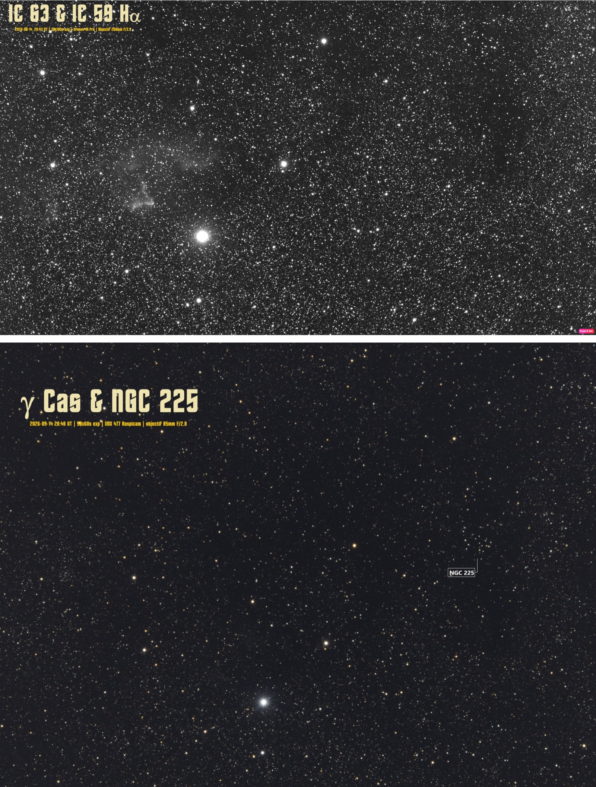

*(Edition 17 Septembre 2026)*
# Spectre de γ Cas et IC 63 au filtre Hα 

[D. Touzan](mailto:dtouzan@gmail.com), 

**Contexte**. Soirées des 14 et 15 Septembre 2026 avec trois instruments sur la monture un objectif de 200mm F/3.5 un filtre Hα 30nm et la camera cmos Uranus-M Pro pour la prise d'images sur les nébuleuses IC 63 et IC 59, un temps de pose cumulé de 90 minutes (30 x 180s) permet d'observer ces 2 nébuleuses. Le deuzième instrument objectif de 85mm F/2 un filtre IR-Cut et la camera cmos IMX477 observe la région de γ Cas et de l'amas ouvert NGC 225, le temps de pose cumulé est alors de 50 minutes (50 x 60s) le résultat est en couleur et les étoiles bien définies dans l'amas. Le troisième instrument est le spectroscope Star Analyser 200 avec un filtre IR-Cut et la camera cmos IMX477 celui ci image le spectre de l'étoile γ Cas, le résultat permet de bien identifier la raie Hα dans un graphique validant cette raie sur la Nova V0488 Sge (constellation de la Flèche). 

**Sujets**:	*nébuleuse Hα, étoile type Be, raie spectrale Hα* 

